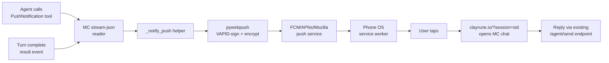

# Web Push Notifications — Implementation Handoff

**Status:** SHIPPED 2026-05-11 (Android-first scope).
**Created:** 2026-05-11 (session a2d8eb20…)
**Implemented:** 2026-05-11 (session d1a072f4…)
**Scope:** Android Chrome first. iOS PWA install path deferred.

> Implementation details: see CHANGELOG.md `[2026-05-11] — Web push
> notifications (Android-first)`. The rest of this file is preserved as
> the original spec for reference and rollback recipes.

---

## Why we're building this

**Problem Ron raised:** When MC-managed agents finish a task, there's no
mechanism that pulls his attention. He has to actively check clayrune.io to
know if something is done or needs input.

**What we ruled out, and why:**

1. **Claude's built-in Remote Control (claude.ai "Code" surface)** — only
   surfaces *interactive* (TTY) sessions. The `--remote-control` flag is
   accepted by `claude` in `--print` mode but doesn't actually open the
   discovery channel. Verified: MC passes the flag (confirmed on live
   command-line of PID 2592 in this session), session file in
   `~/.claude/sessions/` is registered with `kind:"interactive"`, auth matches
   `leviran1@gmail.com` — but the session never appears in claude.ai. Ron
   confirmed a real TTY `claude --remote-control "tty-test"` DID appear,
   ruling out account/feature-gating. Conclusion: MC's `agent_remote_control`
   toggle is currently a no-op and should be marked experimental (`server.py:615-618`).

2. **Building a parallel Telegram bot** — adds account/bot/webhook surface,
   message_id ↔ session_id mapping, and a second chat context to keep
   coherent. Doesn't solve a problem web push doesn't already solve.

**What we found that we ARE using:**

- **Claude's `PushNotification` tool** (deferred tool, schema fetched via
  ToolSearch in this session — see verbatim description below). The model
  knows when to call it ("a long task finished while they were away, a build
  is ready, you've hit something that needs their decision"). The intelligence
  is free; we just need to deliver the notification.

  > "This tool sends a desktop notification in the user's terminal. If Remote
  > Control is connected, it also pushes to their phone."

  Since MC sessions don't register with Remote Control, the "push to phone"
  half never fires. **MC will intercept the `tool_use` event from stream-json
  and deliver the push itself.**

---

## Architecture



The **bidirectional** part is free: clicking the push opens the existing MC
chat UI on the phone, where `/agent/send` already handles follow-ups. No new
chat surface to build.

---

## Implementation plan (todo list)

1. Add `pywebpush>=2.0.0` to `requirements.txt`, pip-install, verify import.
2. Generate VAPID key pair at startup if missing → persist to
   `data/push_vapid.json` (public + private). Add `_load_vapid_keys()` helper
   near top of `server.py` next to existing `_load_session_labels()`.
3. Add backend endpoints (mirror the `# ── Remote-access endpoints` block
   style around `server.py:9351`):
   - `GET  /api/push/vapid-public-key`
   - `POST /api/push/subscribe`        — body: subscription + per-device prefs
   - `POST /api/push/unsubscribe`
   - `GET  /api/push/subscriptions`    — list current devices
   - `POST /api/push/test`             — fire a test push to current device
4. Create `static/sw.js` (new file) — service worker:
   - `self.addEventListener('push', e => self.registration.showNotification(...))`
   - `self.addEventListener('notificationclick', e => clients.openWindow(data.url))`
5. Hook the stream readers — add `_handle_push_signal(project_id, session_id, msg)`
   called from both:
   - `_read_agent_stream` at `server.py:2399`
   - `_read_agent_stream_b` at `server.py:2540`
   Insert after the JSON-parse `msg_type` dispatch (existing handlers at
   `server.py:2424` for `assistant` and `:2472` for `result`). The hook:
   - On `assistant` → scan content blocks; if any `tool_use` with
     `name == "PushNotification"`, extract `input.message`, fire push.
   - On `result` → if project flag `notify_on_turn_complete` is true, fire
     "task complete" push.
6. Frontend — new "Push Notifications" section in Settings (`static/index.html`,
   in the Paths & Server / Remote Access area):
   - "Enable on this device" button → `Notification.requestPermission()` →
     `navigator.serviceWorker.register('/sw.js')` →
     `registration.pushManager.subscribe({applicationServerKey: <vapid pub>})` →
     `POST /api/push/subscribe`.
   - Device list (label + last_used + remove button + per-device toggle for
     "agent push" / "turn complete").
   - "Send test push" button.
7. End-to-end test on Android Chrome via clayrune.io.

---

## Storage schema

`data/push_vapid.json`:
```json
{
  "public": "BO...",
  "private": "...",
  "created_at": "2026-05-11T..."
}
```

`data/push_subscriptions.json` — keyed by CF Access nonce (same key the
existing session-label system uses, so subscriptions can be cleaned up
alongside revoked sessions):
```json
{
  "<nonce>": {
    "label": "Pixel 8",
    "endpoint": "https://fcm.googleapis.com/fcm/send/xyz",
    "keys": {"p256dh": "...", "auth": "..."},
    "project_filter": null,
    "notify_agent_push": true,
    "notify_turn_complete": false,
    "created_at": "...",
    "last_used_at": "..."
  }
}
```

---

## Per-project config additions (project JSON)

- `notify_push_enabled: bool` (default `true`)
- `notify_turn_complete: bool` (default `false` — would be spammy by default)

---

## Verbatim tool description (for reference)

Fetched via `ToolSearch select:PushNotification` in this session:

```
"This tool sends a desktop notification in the user's terminal. If Remote
Control is connected, it also pushes to their phone. Either way, it pulls
their attention from whatever they're doing — a meeting, another task, dinner
— to this session. That's the cost. The benefit is they learn something now
that they'd want to know now: a long task finished while they were away, a
build is ready, you've hit something that needs their decision before you can
continue.

Because a notification they didn't need is annoying in a way that accumulates,
err toward not sending one. Don't notify for routine progress, or to announce
you've answered something they asked seconds ago and are clearly still
watching, or when a quick task completes. Notify when there's a real chance
they've walked away and there's something worth coming back for — or when
they've explicitly asked you to notify them.

Keep the message under 200 characters, one line, no markdown. Lead with what
they'd act on — 'build failed: 2 auth tests' tells them more than 'task done'
and more than a status dump."

Parameters: {message: string<200, status: "proactive"}
```

There's also a `RemoteTrigger` tool (claude.ai `/v1/code/triggers` API) but
it's claude.ai-side scheduling, not relevant to the local push problem.

---

## What to verify after reboot, before starting implementation

1. `claude --version` still ≥ 2.1.121 (no regression in PushNotification tool).
2. `curl -s http://localhost:5199/api/remote/status` shows `enrolled:true,
   online:true, hostname:"ronl.clayrune.io"` — push delivery needs the tunnel.
3. Confirm `requirements.txt` already has `cryptography>=43.0` (yes — for
   pywebpush's underlying encryption).

---

## Why not Telegram

Same attention-pull problem; web push solves it. Telegram adds:
- Bot account management (`@BotFather`, token rotation).
- Webhook endpoint with HMAC verification.
- `message_id ↔ session_id` mapping table for inline replies.
- A second flat chat context that diverges from MC's richer UI (markdown,
  images, plan viewer, agent log).

Reply UX of "tap push → land in clayrune.io chat" is strictly more capable
than Telegram's "reply inline." Defer Telegram until/unless a real pain point
forces it.

---

## Effort estimate (Android-only)

~1 day, broken down:
- VAPID + endpoints + storage: 2 hrs
- Service worker + frontend subscribe flow: 2 hrs
- Stream-reader interceptor + per-project flags: 2 hrs
- End-to-end test on Android: 1 hr
- Polish (test button, device list, error handling): 1 hr
